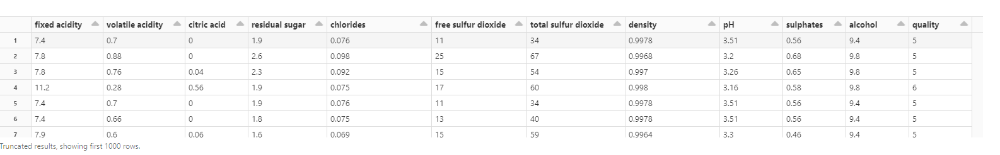
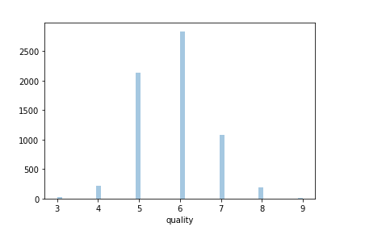
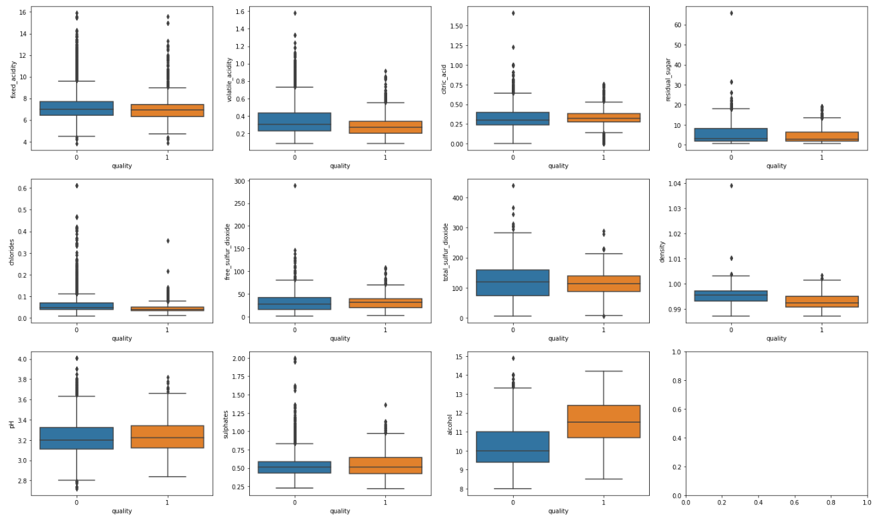
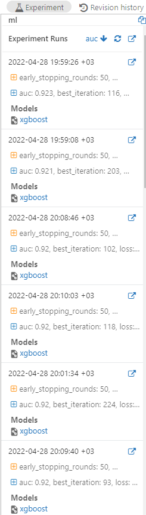
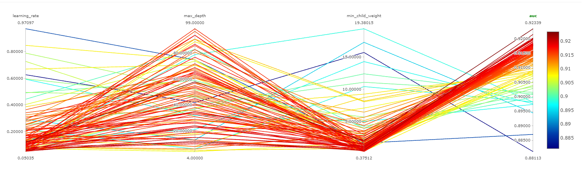
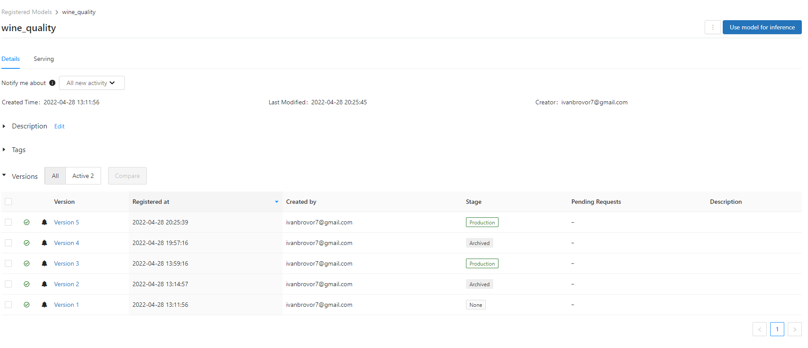
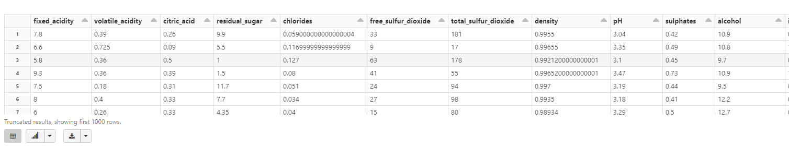
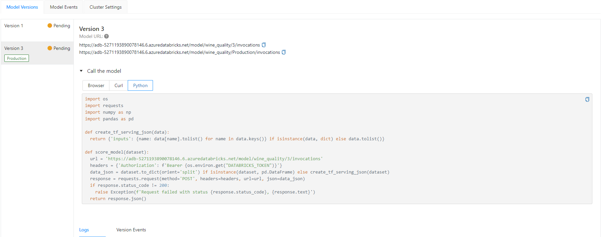

# Installation
```bash
git clone https://github.com/Vlad-Misiukevich/m08_sparkml_python_azure.git
```
# Requirements
* Python 3.8
* Windows OS
* azure-cli
* terraform
# Usage
1. Deploy infrastructure with terraform  
`terraform init`  
`terraform plan -out terraform.plan`  
`terraform apply terraform.plan`
# Description  
* Import data from your local machine into the Databricks File System.  
  Data in DBFS:

* Visualize the data using Seaborn and Matplotlib.  
  Data visualization using seaborn:
  
  Data visualization using matplotlib:  
  
* Run a parallel hyperparameter sweep to train machine learning models on the dataset.  
  Experiment runs sorted by the auc:  
  
  Hyperparameter parallel coordinates plot:

* Register the best performing model in MLflow.  
  Registered models:

* Apply the registered model to another dataset using a Spark UDF.  
  Applying the model to the new data:

* Set up model serving for low-latency requests
